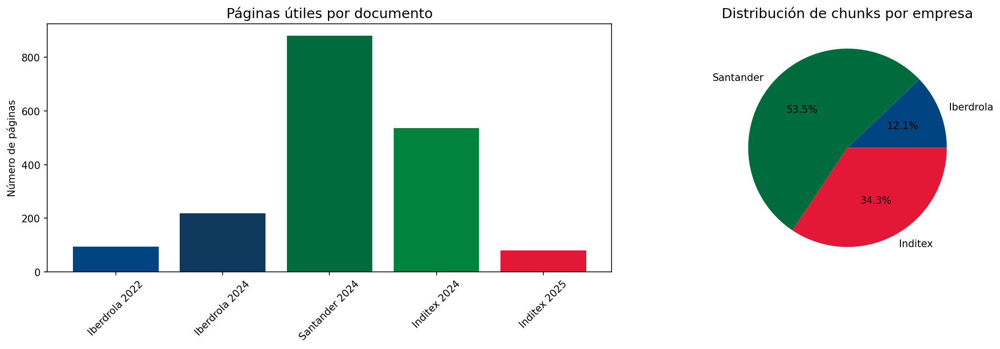
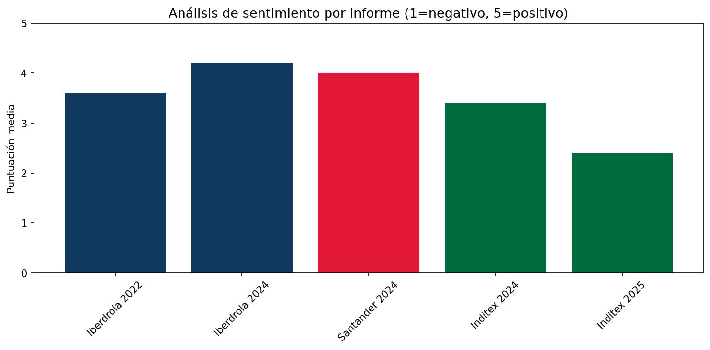

# 📊 Asistente RAG de Análisis Documental Corporativo

[](https://colab.research.google.com/github/alfredobrocalserrano/rag-analisis-corporativo/blob/main/RAG_Analisis_Informes_Corporativos.ipynb)

Sistema de IA Generativa que permite consultar en lenguaje natural 
informes corporativos de grandes empresas españolas.

## 🎯 Objetivo
Demostrar el uso de Retrieval-Augmented Generation (RAG) para extraer 
información estructurada de documentos no estructurados, aplicado 
al análisis financiero y de sostenibilidad.

## 📄 Documentos analizados
| Empresa | Documento | Páginas útiles |
|---|---|---|
| Iberdrola | Informe Biodiversidad 2022 | 94 |
| Iberdrola | Informe Biodiversidad 2024 | 218 |
| BBVA | Informe Anual 2024 | ~390 |
| Santander | Informe Financiero Anual 2024 | 881 |
| Inditex | Memoria Anual 2024 | 536 |
| Inditex | Memoria Anual 2025 | 80 |

## 🏗️ Arquitectura
```
PDFs → PyPDF → Chunking → Embeddings (HuggingFace) → ChromaDB
                                                          ↓
Usuario → Pregunta → Embedding → Búsqueda MMR → Llama 3.3 70B → Respuesta
```

## 🛠️ Tecnologías
- **LangChain** — orquestación del pipeline RAG
- **ChromaDB** — base de datos vectorial
- **HuggingFace** — embeddings multilingües gratuitos
- **Llama 3.3 70B (Groq)** — modelo de lenguaje gratuito
- **Gradio** — interfaz web interactiva
- **Pandas / Matplotlib** — análisis y visualización

## 📊 Resultados



## 🚀 Cómo ejecutarlo
1. Abre el notebook en Google Colab con el botón de arriba
2. Sube los PDFs a `/content/`
3. Obtén una API Key gratuita en [console.groq.com](https://console.groq.com)
4. Ejecuta las celdas en orden

## 📁 Estructura del proyecto
```
rag-analisis-corporativo/
├── RAG_Analisis_Informes_Corporativos.ipynb
├── outputs/
│   ├── eda_documentos.png
│   ├── analisis_sentimiento.png
│   ├── kpis_extraidos.csv
│   └── sentimiento.csv
└── README.md

github.com/tu-usuario                    ← perfil con tu presentación
github.com/tu-usuario/rag-analisis-corporativo  ← proyecto RAG completo
